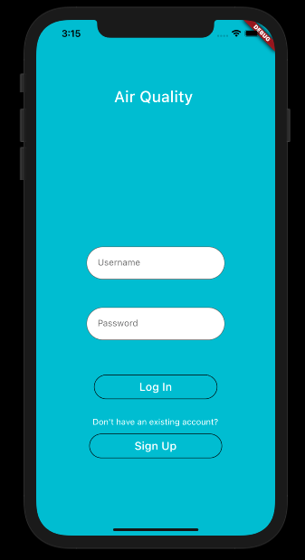
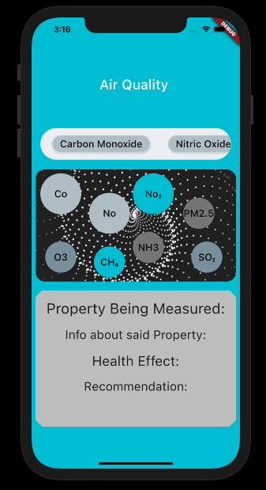
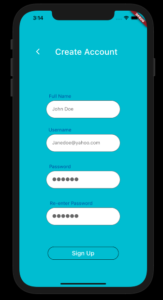

# air_pollution_app

<h1>Quick Synopsis</h1>
<h3> This is a Flutter based Mobile application designed to monitor air quality in a specific zone.
 </h3>

<h1>About</h1>

<h5> This project was designed as part of a two week internship I had with The Problem Solving Agency. A start-up company based in Gateshead.
I was given two weeks to develop an understanding of how Flutter works. This was the final result and my first attempt at app building / using flutter technology
</h5>

<h1>Observation</h1>

<h5>
I was able to immediately see the similarity between flutter, a derivative of the Dart language; and the popular mark up and functional languages like HTML, CSS, and JAVASCRIPT
</h5>

<h1>Take-home<h1>
  
<h5>
 This project gave me an understand of the pace at which one is expected to assimilate and adapt to the ever-changing world of technology. 
 </h5>

